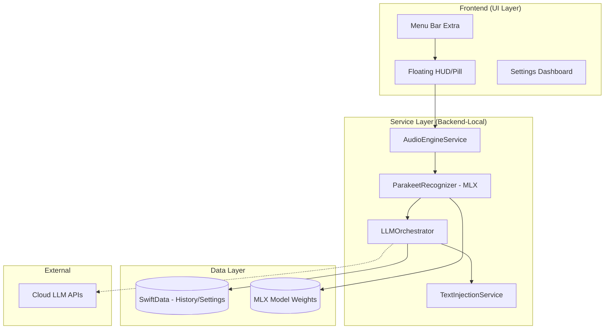
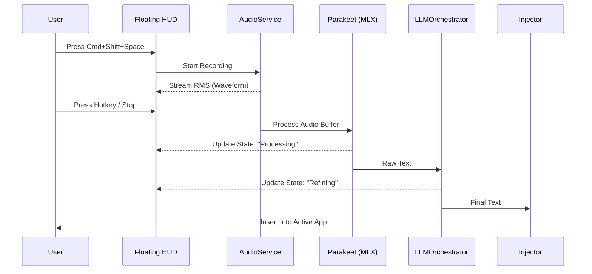

# HyperWhisper Fullstack Architecture Document

## 1. Introduction
This document outlines the complete architecture for HyperWhisper, a native macOS application designed for high-speed local ASR using NVIDIA Parakeet and MLX Swift.

### 1.1 Starter Template or Existing Project
**Status:** Existing Project (Brownfield) - Phase 1 Foundation Complete.
The project utilizes a modular SPM (Swift Package Manager) structure within a native Xcode environment.

### 1.2 Change Log
| Date | Version | Description | Author |
| :--- | :--- | :--- | :--- |
| 2026-01-11 | v1.0 | Initial Fullstack Architecture (YOLO Mode) | Winston (Architect) |

---

## 2. High Level Architecture

### 2.1 Technical Summary
HyperWhisper is built as a **Native Modular Monolith**. It integrates high-performance C++/Metal-backed inference (via MLX) directly into a Swift 6/SwiftUI frontend. The architecture is "Local-First," with an optional "Cloud-Hybrid" path for advanced LLM post-processing. It leverages macOS-specific APIs (AppKit, Accessibility, AVFoundation) to provide a seamless "Pro" user experience.

### 2.2 Platform and Infrastructure
**Platform:** macOS 15+ (Sequoia)
**Key Services:** 
- **Inference:** MLX Swift (local GPU acceleration).
- **Audio:** AVFoundation (AVAudioEngine).
- **Persistence:** SwiftData.
- **Security:** Apple Keychain.

### 2.3 Repository Structure
**Structure:** SPM-based Monorepo.
**Organization:** Logical separation into `App`, `UI`, `Services`, and `Models`.

### 2.4 Architecture Diagram


### 2.5 Architectural Patterns
- **Service-Oriented (Local):** Decoupled services for Audio, Transcription, and LLMs.
- **MVVM:** SwiftUI Views driven by Observable ViewModels.
- **Observer Pattern:** Real-time audio amplitude updates to the HUD.
- **Strategy Pattern:** Interchangeable LLM providers (Local MLX vs. Cloud API).

---

## 3. Tech Stack

| Category | Technology | Version | Purpose | Rationale |
| :--- | :--- | :--- | :--- | :--- |
| Language | Swift | 6.0 | Primary Dev | Native performance, memory safety (Strict Concurrency). |
| UI Framework | SwiftUI | macOS 15 | HUD/Settings | Rapid UI iteration and native feel. |
| Window Mgmt | AppKit | - | Floating Windows | Required for non-activating floating panels. |
| Local ASR | MLX Swift | Latest | Parakeet Inference | Native Apple Silicon GPU acceleration. |
| Audio | AVFoundation | - | Mic Capture | Low-latency system audio integration. |
| Persistence | SwiftData | - | History/Config | Modern, type-safe data modeling. |
| Inference Engine | MLX | - | Local LLM/ASR | Unified memory architecture optimization. |
| Testing | XCTest | - | Unit Testing | Integrated Xcode testing framework. |

---

## 4. Data Models

### 4.1 Transcription
**Purpose:** Represents a single dictation event.
- `id`: UUID
- `timestamp`: Date
- `rawText`: String (Direct ASR output)
- `processedText`: String (After LLM refinement)
- `audioPath`: URL? (Optional path to temp file)
- `modeId`: UUID (The mode used for processing)

### 4.2 Mode
**Purpose:** User-defined processing configurations (e.g., "Prose", "Code").
- `id`: UUID
- `name`: String
- `systemPrompt`: String
- `provider`: Enum (LocalMLX, OpenAI, Anthropic)
- `modelName`: String

---

## 5. API Specification (Internal/External)

### 5.1 Internal Service Protocols
```swift
protocol TranscriptionProvider {
    func transcribe(audio: URL) async throws -> String
}

protocol LLMProvider {
    func process(text: String, prompt: String) async throws -> String
}
```

### 5.2 External API Integration
- **OpenAI/Anthropic:** Standard REST integration for "Cloud Mode".
- **Security:** All keys stored in macOS Keychain.

---

## 6. Core Workflows

### 6.1 Recording & Transcription Flow


---

## 7. Database Schema (SwiftData)

```swift
@Model
class TranscriptionRecord {
    var id: UUID
    var createdAt: Date
    var rawText: String
    var processedText: String
    var modeName: String
    // ...
}
```

---

## 8. Frontend Architecture (macOS Specific)

- **FloatingPanelManager:** Custom `NSPanel` subclass to allow the HUD to float above full-screen apps without stealing focus.
- **Waveform View:** Canvas-based or Shape-based SwiftUI view optimized for 60fps updates from the `AVAudioEngine` tap.

---

## 9. Backend Architecture (Local Service Layer)

- **ParakeetRecognizer:** Manages MLX `Device` and `Stream` for TDT decoding.
- **ModelManager:** Handles downloading and caching Safetensors/NPZ files from HuggingFace to `~/Library/Application Support/HyperWhisper`.

---

## 10. Unified Project Structure

```text
HyperWhisper/
├── Sources/
│   ├── App/                # App Delegate, Lifecycle
│   ├── UI/                 # SwiftUI Views (HUD, Dashboard)
│   ├── Services/           # Core Logic
│   │   ├── Audio/          # AudioEngineService
│   │   ├── Transcription/  # Parakeet/MLX Logic
│   │   ├── LLM/            # Orchestrator & Providers
│   │   └── System/         # Hotkeys, Text Injection
│   ├── Models/             # SwiftData Entities
│   └── Core/               # Constants, Extensions
├── Tests/
└── Resources/              # Localizations, Assets
```

---

## 11. Security & Performance

### 11.1 Performance Targets
- **TDT Latency:** < 200ms on M1 Pro or better.
- **Memory Footprint:** < 1.5GB during active inference (Parakeet 0.6b).

### 11.2 Security
- **Sandbox:** Enabled with `com.apple.security.device.microphone`.
- **Privacy:** Local Mode completely severs network connections during processing.

---

## 12. Testing Strategy
- **Unit Tests:** Focus on `TDTDecoder` logic and `PromptBuilder`.
- **Integration Tests:** `AudioEngine` -> `Transcription` pipeline with pre-recorded WAV files.

---

## 13. Coding Standards (Agent Guidelines)
- **Strict Concurrency:** All services must be `actor` or `@MainActor`.
- **Documentation:** Use DocC for public service interfaces.
- **Error Handling:** Use `LocalizedError` for user-facing ASR/LLM failures.